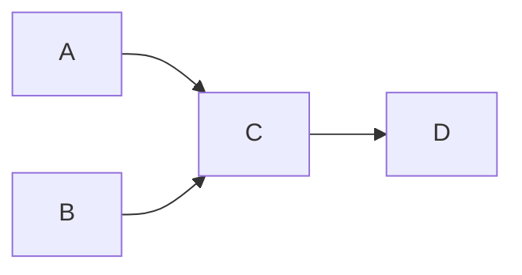

# dag_processor

To install dependencies:

```bash
bun install
```

To run:

Have an instance of redis-stack running
```bash
docker run -d --name redis-stack -p 6379:6379 -p 8001:8001 redis/redis-stack:latest
```

Navigate to `http://localhost:8001/` and accept Redis Terms-of-service. This needs to be done before the main app can access redis

Then run the server:

```bash
bun run src/main.ts
```

You can `POST http://localhost:3000` the following JSON

```json
{
  "data": {
    "A": [],
    "B": [],
    "C": ["A", "B"],
    "D": ["C"]
  }
}
```

Each key is a `Node`, and the values are edges to their upstreams. The above looks like this:



The process with async process A and B, and only begin C once both finished, then finally D once C finishes

Nothing actually gets processed, but there is an artificial 1-5 sec timeout

Part of the response object includes an id field that you can `GET http://localhost:3000/<id>` against to see the updates

